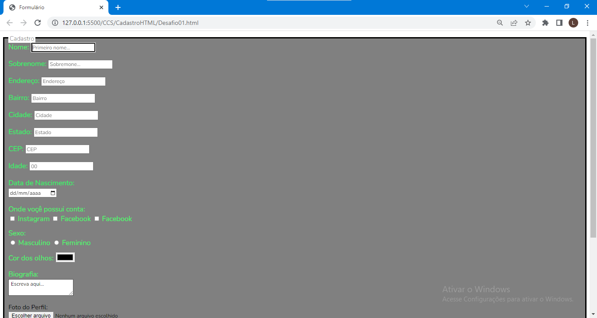

# Cadastro 
 

> Project of a landing page in Portuguese for desktop, where users can register their data and upload to a database.  

> Sample of the finished project with layout for Desktop.

### Steps and Improvements

The project is finished. 
Those are the project steps in order of execution. 

- [x] HTML creation
- [x] CSS cration
- [x] Layout update

## 🤝Developers

We appreciate the commitment and willingness to work on this project:

<table>
  <tr>
    <td align="center">
      <a href="#">
         
        
          <b>Lucas Uller</b>
        
      </a>
    </td>
    
  </tr>
</table>
<a href="https://www.linkedin.com/in/lucas-uller-1a81226b?lipi=urn%3Ali%3Apage%3Ad_flagship3_profile_view_base_contact_details%3BY7lY%2BgFsTjmtPFV19V6lKg%3D%3D">

[⬆ back to the top](#Cadastro) 